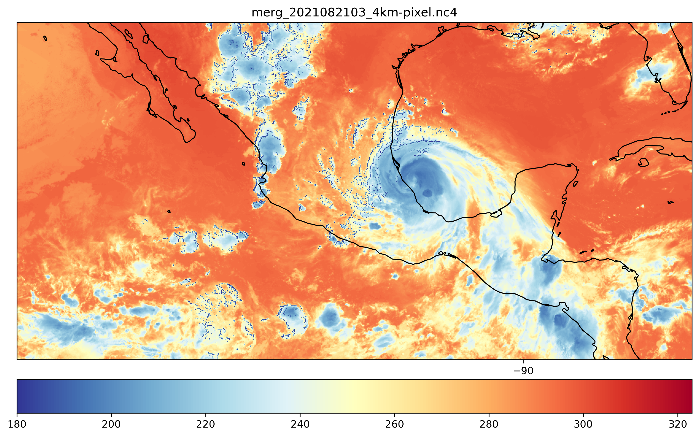

# Storm-Snapshot-Brightness-Temp
Snapshots of brightness temperature from a hurricane.

## Introduction

In this document I describe the steps I followed to create snapshots of brightness temperature data from netCDF4 files. I downloaded the data from GES DISC for hurricane Grace, the most active hurricane at the time. I created a Windows PowerShell script to automatically download the data for the entire day (August 21, 2021). I had to configure my Windows system to allow the execution of these scripts. Then I used the Anaconda IDE distribution of the Python programming language to create a special environment in which I installed Python 3.6, GDAL, and matplotlib. The GDAL library allows us to open the climate data, and matplotlib to create a figure for the snapshots.

## Download the data

* Create an account in EarthData: <https://urs.earthdata.nasa.gov/profile>
* Link your EarthData account to GES DISC following the instructions: <https://disc.gsfc.nasa.gov/earthdata-login.>
* Go to GES DISC <https://disc.gsfc.nasa.gov/>, search for “IR CPC”.
* From the results select NCEP/CPC L3 Half Hourly 4km Global (60S - 60N) Merged IR V1 (GPM_MERGIR 1).
* Click on Subset / Get Data.
* Select the dates for the storm or hurricane.
* Click on Get Data. Then Download links list, and a text file with all the links for the products you selected will be downloaded.

### Create a Windows PowerShell script

I created a PowerShell script to automatically download all the links.

The content of the script should be as follows. In the $dir variable set the directory to download the products. $username should match your EarthData user name, file list should be the name of the text file you downloaded with all the links. Be sure to place the file in the same directory as above. Save the file with the extension *.ps1

#### A script to download data from NASA GES DISC

    # A script to download data from NASA GES DISC
    # By Eduardo Jimenez Hernandez, PhD student University of Arizona
    # 27 Aug 2021
    $dir = "D:\Dropbox\PhD_BE\2021_Fall\ATMO_555_Introd_Atm_Hydr_Rem_Sensing\Assignment02"
    $username = "eduardojh"
    $filelist = $dir + "\subset_GPM_MERGIR_1_20210827_210845.txt"
    $cookies = $dir + "\.urs_cookies"
    # Create cookies file in order to save the login information when downloading multiple files
    $null > $dir\.urs_cookies
    # Download files from a text file
    wget --load-cookies $cookies --save-cookies $cookies --auth-no-challenge=on --keep-session-cookies --user=$username --ask-password -i $filelist

#### Change execution policy

For my computer it was necessary to give execution permission to Powershell scripts. From the Start menu in Windows write PowerShell and right click on it to “Run as administrator”. Execute the command:

    Set-ExecutionPolicy Unrestricted

When prompted, introduce A to accept all.

**Important**: You should be aware that this allows the execution of any PowerShell script, even malware. So use it under your own responsibility and be careful.

#### Install wget

Wget is the application to download files from the internet using the command line. Powershell by default as an alias for wget which points to Invoke-WebRequest (use the command `Get-Alias wget | ft -auto` to verify this), in order to use the correct wget executable file you should remove the alias.

Download wget executable from: <https://eternallybored.org/misc/wget/>

Place the executable into one of the path directories of the system, for your current user the directory: `C:\Users\<username>\AppData\Local\Microsoft\WindowsApps` should be enough.

Open the profile by running the following command inside the Powershell running as Administrator:

    notepad $profile

Then paste and save:

    Remove-Item alias:wget
    Remove-Item alias:curl

Optional: curl is another command that is usually used along wget.

If there is no profile file and you get an error message, create it:

    New-Item $profile -ItemType file -Force

Finally, everything should work, run the script and download the files, type .\ and the name of your file ps1, mine is:

    .\download_ges_disc.ps1

The first time it will ask for your password from EarthData.

## Preparing Python and Anaconda IDE

For this assignment I will be using the Anaconda integrated development environment, which can be installed in Windows, Linux and macOS from <https://www.anaconda.com/>. Anaconda allows you to create environments with a specific version of Python with specific modules, this is a convenient way to isolate a custom configuration for a particular project.  

Once Anaconda is installed, using the Anaconda Powershell prompt, we can create a new environment, and activate it in order to install Python and the required libraries. I created an environment called atmo555 and installed Python 3.6, then I installed libraries to manipulate netCDF4 files and plot the information.

    conda create --name atmo555
    conda install -n atmo555 python=3.6
    conda activate atmo555

Install libraries, for this project we need gdal, matplotlib and cartopy. I also installed spyder to edit the Python code.

    conda install -n atmo555 -c conda-forge gdal
    conda install -n atmo555 -c conda-forge matplotlib
    conda install -n atmo555 -c conda-forge spyder
    conda install -n atmo555 -c conda-forge cartopy

Once the libraries are installed, type spyder to open the editor and start writing the code.

The code I used to create the snapshot is shown below. There are many libraries to open a netCDF4 file in Python, but I decided to use GDAL.

    # -*- coding: utf-8 -*-
    """ ATMO555 Assignment 02. Brightness temperature from netCDF4 file, 8/30/2021
    @author: eduardo
    """
    from osgeo import gdal
    import matplotlib.pyplot as plt
    import cartopy.crs as ccrs

    THRESHOLD = 180 # Remove data below this temp (in Kelvin)

    # Open the netCDF4 file
    dr = 'DATA/'
    fn = 'merg_2021082103_4km-pixel.nc4'
    ds = gdal.Open(dr + fn)

    # Explore the datasets within the file
    print("Datasets:")
    for item in ds.GetSubDatasets():
        print(item[0])

    # Open the subdataset in the format 'NETCDF:"DATA/merg_2021082103_4km-pixel.nc4":Tb'
    tb = gdal.Open(ds.GetSubDatasets()[0][0])  # First subdataset from the first dataset

    # Show some metadata
    for key, value in tb.GetMetadata().items():
        print("{:35}: {}".format(key, value))
    print('Band shape (T, Y, X): ', (tb.RasterCount, tb.RasterYSize, tb.RasterXSize))
    print('Projection: ', tb.GetProjection())

    # Get the geotransform metadata (extension) of the figure to scale the figure
    geoTransform = tb.GetGeoTransform()
    print(geoTransform)
    minx = geoTransform[0]
    maxy = geoTransform[3]
    maxx = minx + geoTransform[1] * tb.RasterXSize
    miny = maxy + geoTransform[5] * tb.RasterYSize
    print("Spatial extent [minx,miny,maxx,maxy]: ", [minx, miny, maxx, maxy])

    # Extract the temperature matrix data
    data = tb.ReadAsArray(0, 0, tb.RasterXSize, tb.RasterYSize)
    data[data < THRESHOLD] = THRESHOLD  # Remove data below threshold

    # Create a figure and plot a coastline
    plt.figure(figsize=(12,12))
    ax = plt.axes(projection=ccrs.PlateCarree())
    ax.coastlines()
    ax.set_xticks([-180,-90,0,90,180])
    ax.set_yticks([-60,0,60])

    # Plot the temperature matrix data and save the figure
    plt.imshow(data[0], extent=[minx,maxx,miny,maxy], cmap='RdYlBu_r') # This has two times: 0 or 1
    plt.title(fn)
    plt.colorbar(orientation='horizontal', pad=0.03)
    plt.savefig('snapshot_' + fn[:-4] + '.png', dpi=300, bbox_inches='tight')

    # Zoom to the hurricane
    plt.ylim(10, 30)
    plt.xlim(-120, -80)
    plt.savefig('snapshot_' + fn[:-4] + '_zoom.png', dpi=300, bbox_inches='tight')

    plt.show()

I selected hurricane Grace, the most recent event at the moment (August 27, 2021) which reached Category 3 on August 19, 2021.

The final snapshots of the hurricane are presented in the figures below.

**Note 1**: A geotransform is an affine transformation from the image coordinate space (row, column), also known as (pixel, line) to the georeferenced coordinate space (projected or geographic coordinates). A geotransform consists in a set of 6 coefficients:

* GT(0) x-coordinate of the upper-left corner of the upper-left pixel.
* GT(1) w-e pixel resolution / pixel width.
* GT(2) row rotation (typically zero).
* GT(3) y-coordinate of the upper-left corner of the upper-left pixel.
* GT(4) column rotation (typically zero).
* GT(5) n-s pixel resolution / pixel height (negative value for a north-up image).

With the geotransform metadata we can extend and/or scale the figure to the proper limits extent, the values should be scalars in the right order: left, right, bottom, and top.

**Note 2**: I used the HDFView application in order to open the netCDF4 file and have a visual idea of how it is organized. There are four datasets in this file called Tb, lat, lon and time. The brightness temperature is located in the Tb dataset.

## References

* Documentation about netCDF4 format: <https://unidata.github.io/netcdf4-python/>
* Conda environment: <https://conda.io/projects/conda/en/latest/user-guide/tasks/manage-environments.html#activating-an-environment>
* Using netCDF with GDAL: <https://nci-data-training.readthedocs.io/en/latest/_notebook/eo/Python_GDAL_NetCDF.html>
* Cartopy for coastline: <https://scitools.org.uk/cartopy/docs/v0.15/matplotlib/intro.html>
* GDAL geotransform: <https://gdal.org/tutorials/geotransforms_tut.html>
